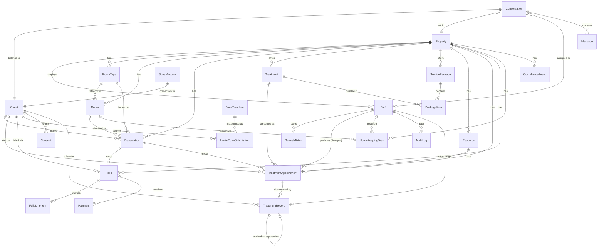

# Domain Model

Entity-relationship diagram for the PMS data model. Three data planes:
**operational**, **financial**, **compliance/audit**.

## Data planes

| Plane | Entities |
|---|---|
| **Operational** | Property, Staff, Guest, RoomType, Room, Reservation, Treatment, ServicePackage, PackageItem, Resource, TreatmentAppointment, HousekeepingTask |
| **Financial** | Folio, FolioLineItem, Payment |
| **Compliance/Audit** | AuditLog (append-only), ComplianceEvent |
| **Clinical** (Phase 6) | FormTemplate, IntakeFormSubmission, Consent, TreatmentRecord |
| **Messaging** (Phase 10) | GuestAccount (`src/modules/guest-auth`), Conversation, Message (both `src/modules/messaging`) |

## Key invariants (enforced in the service layer)

- **Reservation conflict:** no two reservations with status ∉ {CANCELLED, NO_SHOW} share a `roomId`
  with overlapping `[checkInDate, checkOutDate)`.
- **Appointment double-booking:** a therapist and a resource each cannot have two appointments with
  status ∉ {CANCELLED, NO_SHOW} whose `[startTime, endTime)` overlap. Therapist must have role
  THERAPIST; resource type must match the treatment's `requiredResourceType`.
- **Folio balance:** Σ `FolioLineItem.amountMinor` − Σ `Payment.amountMinor`.
- **Audit:** every state-changing operation writes exactly one append-only `AuditLog` row.
- **Consent gate (clinical):** a `TreatmentRecord` can be created only when the guest has
  non-revoked `TREATMENT` and `GDPR_DATA_PROCESSING` consents.
- **Clinical immutability:** a `TreatmentRecord` is immutable once `SIGNED`; corrections are new
  addendum records (`supersededById` → prior record); the original is never mutated. Every
  clinical read/write is audit-logged (`AuditAction.READ` for reads).
- **One conversation per guest:** `Conversation.guestId` is `@unique`; created lazily on first guest
  message or fetch. A guest message to a `CLOSED` conversation auto-reopens it; a staff message to a
  closed conversation returns 409.
- **AI authority:** the AI acts as a seeded `Staff` row with role `AI_AGENT`; it is subject to the
  same RBAC, conflict-detection, and append-only audit as human staff. It is denied
  `folio:*`, all `clinical:*`/`consent:*`, `*:delete`, `staff:manage`, `compliance:manage`,
  `report:read`. Every AI message and AI booking is an `AuditLog` row with the `AI_AGENT` actor.
