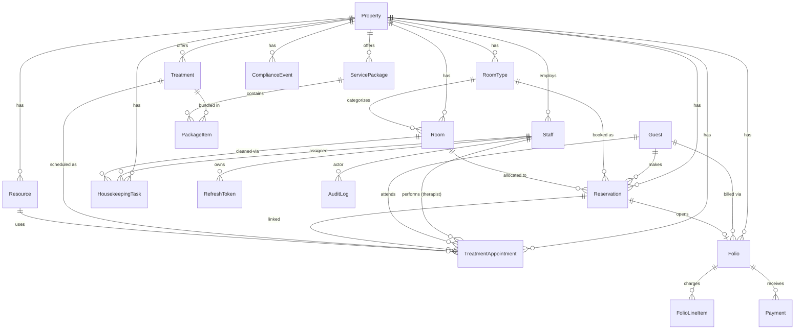

# Domain Model

Entity-relationship diagram for the PMS data model. Three data planes:
**operational**, **financial**, **compliance/audit**.

## Data planes

| Plane | Entities |
|---|---|
| **Operational** | Property, Staff, Guest, RoomType, Room, Reservation, Treatment, ServicePackage, PackageItem, Resource, TreatmentAppointment, HousekeepingTask |
| **Financial** | Folio, FolioLineItem, Payment |
| **Compliance/Audit** | AuditLog (append-only), ComplianceEvent |

## Key invariants (enforced in the service layer)

- **Reservation conflict:** no two reservations with status ∉ {CANCELLED, NO_SHOW} share a `roomId`
  with overlapping `[checkInDate, checkOutDate)`.
- **Appointment double-booking:** a therapist and a resource each cannot have two appointments with
  status ∉ {CANCELLED, NO_SHOW} whose `[startTime, endTime)` overlap. Therapist must have role
  THERAPIST; resource type must match the treatment's `requiredResourceType`.
- **Folio balance:** Σ `FolioLineItem.amountMinor` − Σ `Payment.amountMinor`.
- **Audit:** every state-changing operation writes exactly one append-only `AuditLog` row.
